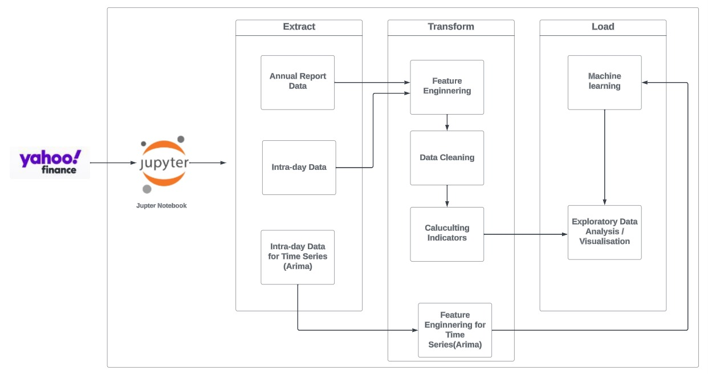
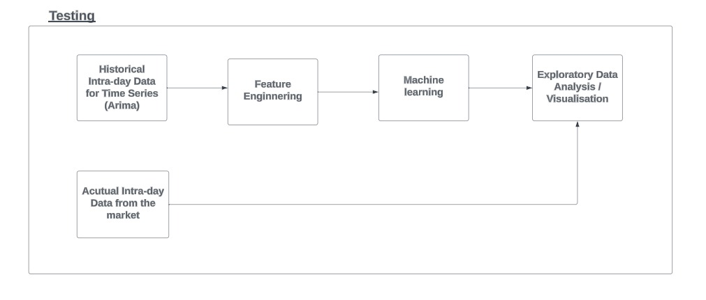
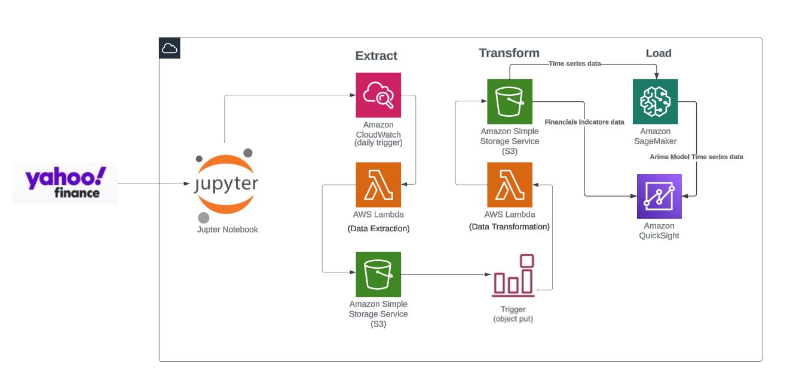

# E-T-L pipeline to perform data analysis on stock market data.

• Automated ETL pipeline capable of handling dynamic inputs, reduced manual data processing time by 70% and
streamlining financial metric calculations.
• Developed a Timeseries model which achieved prediction accuracy within 5% of actual stock prices for the initial
5-day forecast period.
• Proposed cloud-based architecture enhanced data processing scalability by 80% and reduced latency by 40%,
using AWS services.
* Tech Stack: * Python, Jupyter Notebook, AWS Cloud Architecture
### Proposed aws architecture

